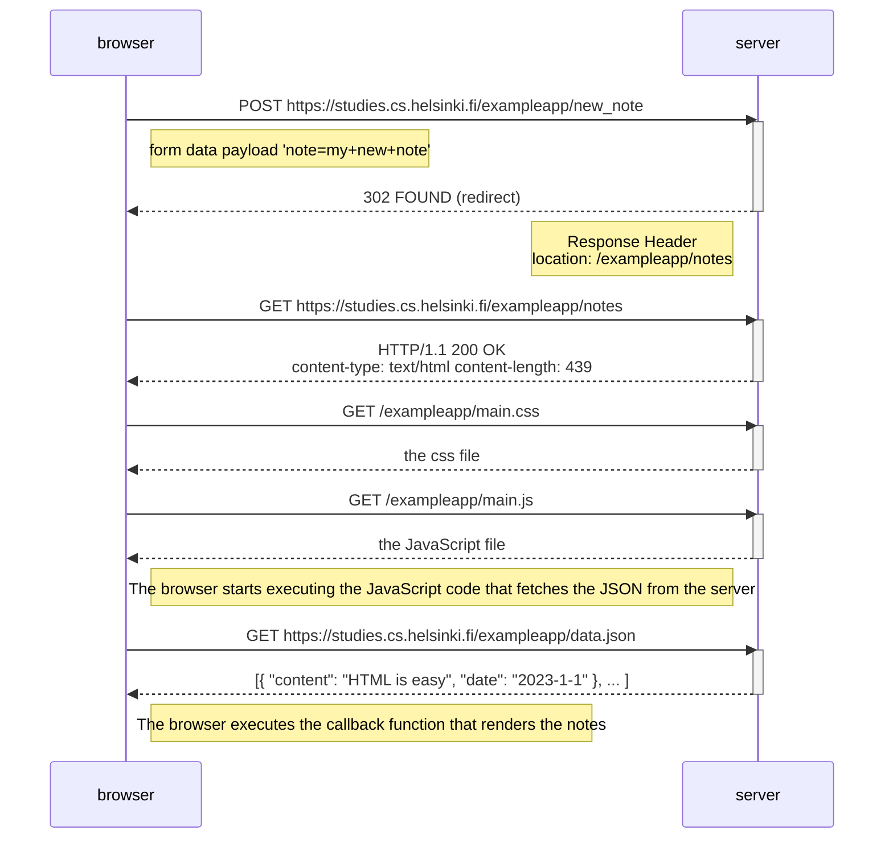

```mermaid
sequenceDiagram
    participant browser
    participant server

    browser->>server: POST https://studies.cs.helsinki.fi/exampleapp/new_note
    activate server
    Note right of browser: form data payload 'note=my+new+note'
    
    server-->>browser: 302 FOUND (redirect)
    deactivate server
    Note left of server: Response Header <br> location: /exampleapp/notes
    
    browser->>server: GET https://studies.cs.helsinki.fi/exampleapp/notes
    activate server
    server-->>browser: HTTP/1.1 200 OK <br> content-type: text/html content-length: 439
    deactivate server

    browser->>server: GET /exampleapp/main.css
    activate server
    server-->>browser: the css file
    deactivate server

    browser->>server: GET /exampleapp/main.js
    activate server
    server-->>browser: the JavaScript file
    deactivate server

    Note right of browser: The browser starts executing the JavaScript code that fetches the JSON from the server

    browser->>server: GET https://studies.cs.helsinki.fi/exampleapp/data.json
    activate server
    server-->>browser: [{ "content": "HTML is easy", "date": "2023-1-1" }, ... ]
    deactivate server

    Note right of browser: The browser executes the callback function that renders the notes
```
